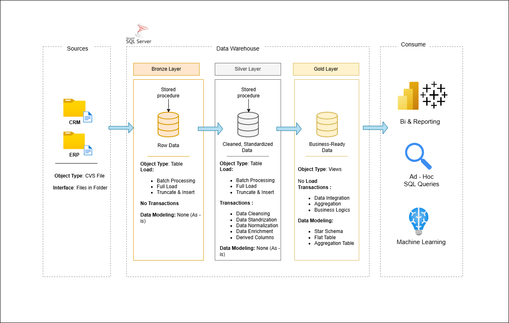

# 🏗️ Retail Data Warehouse Project

A data warehouse project for retail sales analytics using SQL Server, ETL processes, and dimensional modeling.

---

## 📌 Project Overview
This project demonstrates the design and implementation of a retail data warehouse to support business intelligence and analytical reporting.

The solution integrates data from multiple sources (ERP & CRM), applies ETL transformations, and structures data into a star schema optimized for analytical queries and insights.

💎This project involves:

1. *Data Architecture*: Designing a Modern Data Warehouse Using Medallion Architecture **Bronze, **Silver, and **Gold* layers.
2. *ETL Pipelines*: Extracting, transforming, and loading data from source systems into the warehouse.
3. *Data Modeling*: Developing fact and dimension tables optimized for analytical queries.
4. *Analytics & Reporting*: Creating SQL-based reports and dashboards for actionable insights.
   
---

## 🎯 Objectives
- Build a scalable retail data warehouse
- Apply ETL processes (Extract, Transform, Load)
- Design fact and dimension tables
- Ensure data quality and consistency
- Enable analytical reporting for decision-making

---

## 🎯 This repository is an excellent resource for professionals and students looking to showcase expertise in:
- SQL Development
- Data Architect
- Data Engineering  
- ETL Pipeline Developer  
- Data Modeling  
- Data Analytics  

---

## 🛠️ Tech Stack
- SQL Server  
- SQL  
- ETL Concepts  
- Data Warehousing  
- Dimensional Modeling  

---

## 🧱 Data Architecture

This project follows the **Medallion Architecture**:

- **Bronze Layer 🟤**  
  Raw data ingestion from source systems (CSV files, ERP, CRM)

- **Silver Layer ⚪**  
  Data cleaning, transformation, and standardization

- **Gold Layer 🟡**  
  Business-ready data modeled as a **Star Schema** for analytics

The data architecture for this project

---

## ⚙️ ETL Pipeline

The ETL process includes:

1. Extracting data from multiple sources  
2. Cleaning and handling missing/inconsistent values  
3. Transforming and standardizing data  
4. Loading structured data into dimension and fact tables  

---

## 📊 Data Modeling

The warehouse is designed using **Star Schema**, including:

### Dimension Tables:
- DimCustomer  
- DimProduct  
- DimDate  
- DimStore  

### Fact Table:
- FactSales  

---

## 📂 Repository Structure

data-warehouse-project/
│
├── datasets/                           # Raw datasets used for the project (ERP and CRM data)
│
├── docs/                               # Project documentation and architecture details
│   ├── etl.drawio                      # Draw.io file shows all different techniquies and methods of ETL
│   ├── data_architecture.drawio        # Draw.io file shows the project's architecture
│   ├── data_catalog.md                 # Catalog of datasets, including field descriptions and metadata
│   ├── data_flow.drawio                # Draw.io file for the data flow diagram
│   ├── data_models.drawio              # Draw.io file for data models (star schema)
│   ├── naming-conventions.md           # Consistent naming guidelines for tables, columns, and files
│
├── scripts/                            # SQL scripts for ETL and transformations
│   ├── bronze/                         # Scripts for extracting and loading raw data
│   ├── silver/                         # Scripts for cleaning and transforming data
│   ├── gold/                           # Scripts for creating analytical models
│
├── tests/                              # Test scripts and quality files
│
├── README.md                           # Project overview and instructions
├── LICENSE                             # License information for the repository
├── .gitignore                          # Files and directories to be ignored by Git
└── requirements.txt                    # Dependencies and requirements for the project

---
